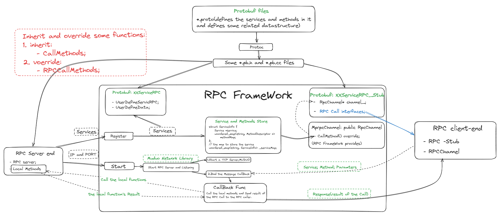
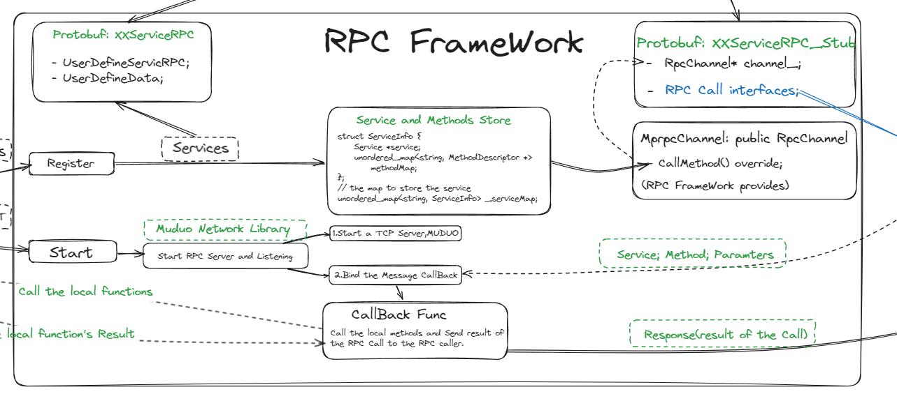
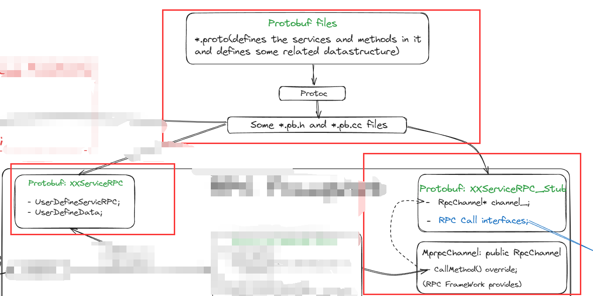
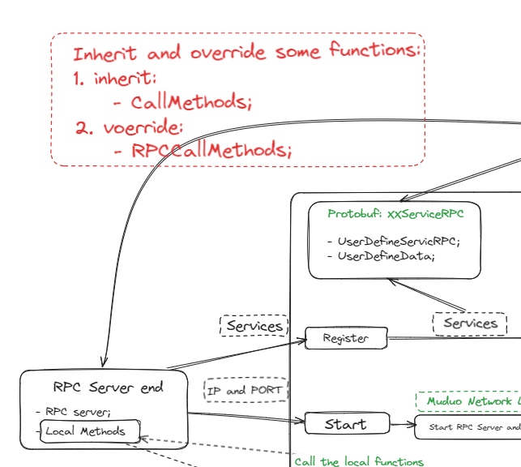
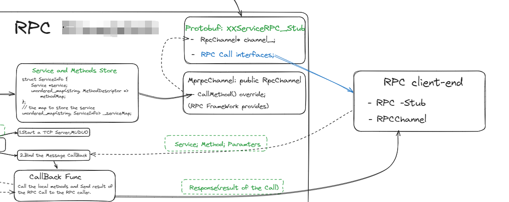

# 1. A RPC frame based on muduo and Protobuf
The RPC frame is implemented using protobuf and muduo network library.

The server-end's core module is class `RpcProvider` which includes the server start and register the rpc services.

The client-end's core module is class `MprpcController: public google:protobuf:RpcController` which controll the status of the RPC and the class `MprpcChannel : public google:protobuf:RpcChannel` providing the function `CallMessage(...) override{}`.

# 2. Global view for the framework



1. The RPC framework part:


2. The Protobuf part: w


3. The server end:


4. The client end:


# 3. How to use this framework?
## 3.1 Server side:
You can find the example code in examples [folder](./examples/callee/userservice.cc).

First we should define our request and response structure like this:
```C++
syntax = "proto3";
package kirito;
option cc_generic_services = true;
message Result {
    int32 errorCode = 1;
    bytes errorMessage = 2;
}
message LoginRequest {
    bytes name = 1;
    bytes password = 2;
}
message LoginResponse {
    Result result = 1;
    bool success = 2;
}
message UserInforRequest {
    int32 userid = 1;
}
message UserInfo {
    bytes name = 1;
    bytes password = 2;
    bytes email = 3;
    bytes phone = 4;
}
message UserInfoResponse {
    Result result = 1;
    UserInfo userInfo = 2;
}
service UserServiceRPC {
    rpc Login(LoginRequest) returns(LoginResponse);
    rpc GetUserInfo(UserInforRequest) returns(UserInfoResponse);
}
```
Then use the protoc to generate some source files. We can use the defined data structures by these generated files like this:
```C++
#include "user.pb.h"
```
Then we override the RPC functions which is auto generated by the protoc:
```C++
// the service implement, callee
class UserService : public kirito::UserServiceRPC {
public:
  // the real local function
  bool Login(std::string name, std::string pwd) {
    std::cout << "You login successfully!" << std::endl;
    std::cout << "name: " << name << std::endl
              << "password:" << pwd << std::endl;
    return true;
  }
  // override from LoginServiceRPC
  void Login(::PROTOBUF_NAMESPACE_ID::RpcController *controller,
             const ::kirito::LoginRequest *request,
             ::kirito::LoginResponse *response,
             ::google::protobuf::Closure *done) override {
    /*
      The rpc framework already process the data from caller and put them into
      the request. So we can get the data from the request directly.
    */
    std::string name = request->name();
    std::string pwd = request->password();

    // call the real implement
    bool login_result = Login(name, pwd);

    // write the response to the response
    response->set_success(login_result);

    kirito::Result *result = response->mutable_result();
    result->set_errorcode(200);
    result->set_errormessage("Login successfully");

    // notify the rpc framework, execute the serilization and send the response
    // to the caller
    done->Run();
  }
};
```
In this codes, the function `Login(std::string name, std::string pwd)` is the real local call, and the `void Login(::PROTOBUF_NAMESPACE_ID::RpcController *controller, ...) override ` is the RPC Call. 
And we should define this fcuntion in the class `UserService : public kirito::UserServiceRPC`, then we register the service and method into our framework using class `RpcProvider`:
```C++
int main(int argc, char **argv) {
  // 0. the rpc framework initialize(just simple load a config file)
  MprpcApplication::Initialize(argc, argv);

  // 1. register the service
  RpcProvider provider;
  provider.NotifyService(new UserService());
  // 2. run the rpc server and block the server
  provider.Start();
  return 0;
}
```

The class `MprpcApplication` is designed to load some config by the arguments. Finally we can start the RPC server and listen to the request.
## 3.2 Client Side
The client side we should do just initialize the config(include the server ip and port etc.) and create a `UserServicePRC_Stub` object and `MprpcChannel` object(send the RPC request to the server-end).

And we should define the `MprpcController` object to hold the status of thE rpc call. If the rpc call runs failed, the `MprpcController::Failed()` will return true.

Then we can define the request and response which already defined by the server-end.


Finally, we just call `stub.Login(&controller, &request, &response, nullptr);
` to send the request to server-end, and the result will be stored in response. 


```C++
int main(int argc, char **argv) {
  // Initialize the config
  MprpcApplication::getInstance().Initialize(argc, argv);
  kirito::UserServiceRPC_Stub stub(new MprpcChannel());
  kirito::LoginRequest request;
  request.set_name("kirito");
  request.set_password("123456");

  kirito::LoginResponse response;
  LOG_INFO("==>begin test the RPC login()");
  MprpcController controller;
  // call the RPC function
  stub.Login(&controller, &request, &response, nullptr);

  // check the RPC status
  if (controller.Failed()) {
    std::cout << controller.ErrorText() << std::endl;
    return 0;
  }

  if (0 == response.result().errorcode()) {
    std::cout << "rpc login response error: "
              << response.result().errormessage() << std::endl;
  } else {
    std::cout << "rpc login response successfully: "
              << response.result().errormessage() << std::endl;
  }
}
```

# 4. How build the project?
If you wnat to use the library you need to download the `libmprpc.a` in the lib fold and the header files in the `src/include` and put them in your project.

Here is a example using cmake:
```cmake
cmake_minimum_required(VERSION 3.10)
project(example)

# set the output dir
set(EXECUTABLE_OUTPUT_PATH ${PROJECT_SOURCE_DIR}/bin/server)

aux_source_directory(. SRC_LIST)
add_executable(example ${SRC_LIST})

target_include_directories(example ${the_path_of_the_header_files})
target_link_directories(example ${the_path_of_the_libmprpc.a})
target_link_libraries(example mprpc)
```

